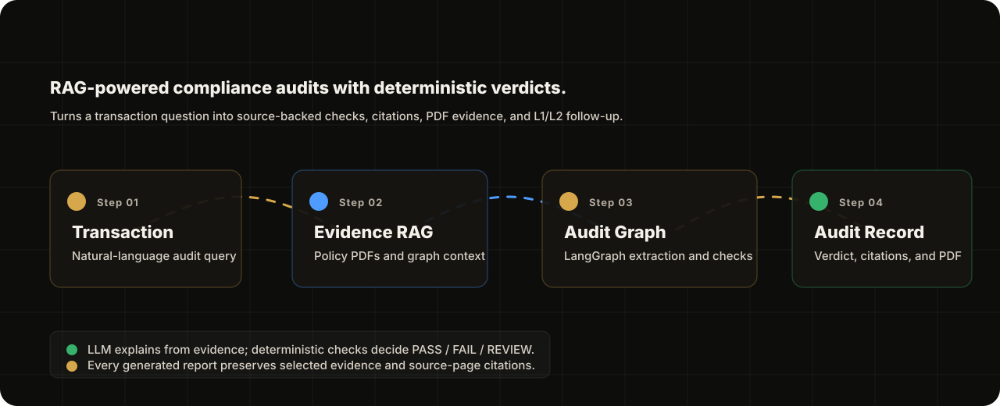
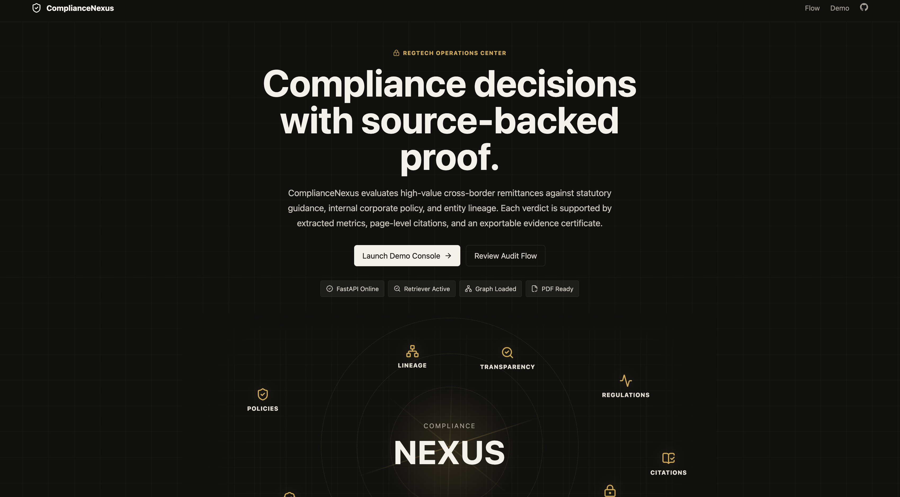
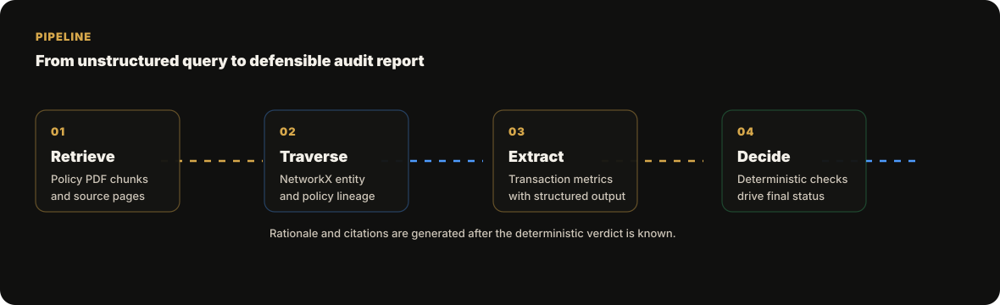
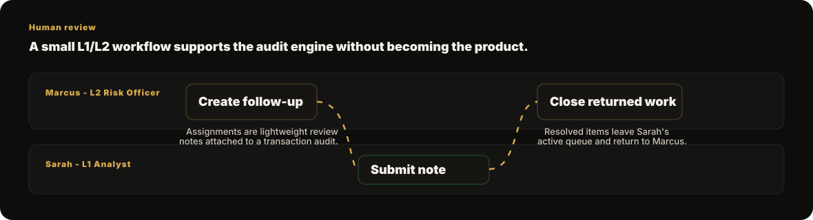

# ComplianceNexus
<p align="center">
  <a href="https://compliance-nexus.vercel.app/"><b>Open the live demo</b></a>
</p>
<p align="center">
  
</p>

ComplianceNexus is a RegTech audit workspace for evaluating
cross-border transaction compliance. It combines document retrieval,
graph-guided context expansion, LangGraph agent orchestration, deterministic
compliance checks, citation validation, structured dashboard reports,
downloadable PDF certificates, and a lightweight L1/L2 follow-up flow.

The core design principle is simple:

> The LLM explains from retrieved evidence, but deterministic checks decide the
> verdict.

## Demo

<p align="center">
  <a href="https://www.loom.com/share/689b10c3cd7f424fb1eb36cd0efe5216">
    
  </a>
</p>

<p align="center">
  <a href="https://compliance-nexus.vercel.app/"><b>Open the live demo</b></a>
  ·
  <a href="https://www.loom.com/share/689b10c3cd7f424fb1eb36cd0efe5216"><b>Watch the full demo video</b></a>
</p>

## Why This Exists

Most compliance demos stop at a generated paragraph or a binary verdict.
ComplianceNexus focuses on the harder question:

> Can a transaction decision be traced back to source evidence, structured
> checks, and reviewer action?

The system turns a natural-language audit request into:

- extracted transaction facts,
- selected evidence chunks from policy PDFs,
- deterministic PASS / FAIL / REVIEW checks,
- an evidence-backed rationale,
- citation integrity validation,
- a dashboard report,
- a PDF audit certificate,
- and optional L1/L2 follow-up notes.

## Evaluation Benchmark

ComplianceNexus includes a zero-cost offline evaluation harness under
[`evaluation/`](./evaluation/). It benchmarks retrieval quality, seeded audit
correctness, citation grounding, and retrieval latency without paid
LLM-as-judge APIs.

Current benchmark summary:

- Retrieval Recall@10: `96.9%`
- Retrieval MRR: `1.000`
- Retrieval NDCG@10: `0.958`
- BM25 Recall@10: `100.0%`
- Hybrid RRF Recall@10: `100.0%`
- Seeded status accuracy: `100.0%`
- Expected source coverage: `100.0%`

See [`evaluation/results/summary.md`](./evaluation/results/summary.md) for the
latest report.

## Architecture

<p align="center">
  
</p>

The audit path is intentionally split between probabilistic and deterministic
responsibilities.

| Stage | Responsibility |
| --- | --- |
| Retrieval | Pull transaction-relevant chunks from processed compliance PDFs. |
| Graph traversal | Expand context through entity, policy, and source-document relationships. |
| Structured extraction | Use the LLM to parse transaction metrics and governing source anchors. |
| Deterministic checks | Evaluate numeric ceilings, KYC gaps, investment-route risk, director exposure, cumulative exposure, and crypto beneficiary risk. |
| Rationale generation | Use the LLM to explain the deterministic result using attached evidence. |
| Citation validation | Ensure the claimed governing source resolves to a retrieved source document. |
| Persistence | Save audit records, structured checks, evidence, citations, and PDF path. |

## Core Capabilities

<table>
<tr>
<td width="50%" valign="top">

### Evidence-Backed RAG

Retrieves source chunks from policy and regulatory PDFs, then selects evidence
based on rule language, transaction facts, source match, and threshold match.

</td>
<td width="50%" valign="top">

### LangGraph Audit Pipeline

Runs a multi-step agent graph for context retrieval, topology traversal,
structured extraction, deterministic evaluation, rationale generation, and
citation validation.

</td>
</tr>
<tr>
<td width="50%" valign="top">

### Deterministic Verdict Engine

Final statuses are driven by structured checks:

- `COMPLIANT`
- `NON_COMPLIANT`
- `ACTION_REQUIRED`

The verdict does not depend on prose generation alone.

</td>
<td width="50%" valign="top">

### Structured Audit Reports

Dashboard reports expose transaction facts, deterministic checks, attached
evidence, rationale, citations, and recommended action. PDFs are generated from
the same audit state.

</td>
</tr>
<tr>
<td width="50%" valign="top">

### Dynamic Knowledge Graph

Each transaction can be inspected through a focused topology graph showing the
relevant corporate entities, policy sources, and audit relationships.

</td>
<td width="50%" valign="top">

### L1/L2 Follow-Up Review

Marcus can assign follow-up work to an analyst. Sarah can submit a resolution
note. Returned work appears for Marcus and can be closed.

</td>
</tr>
</table>

## Audit Decision Model

ComplianceNexus separates the decision surface from the explanation layer.

```text
Transaction query
  -> retrieved document chunks
  -> graph lineage context
  -> structured extracted metrics
  -> deterministic audit checks
  -> LLM rationale constrained by evidence
  -> citation validation
  -> dashboard report and PDF certificate
```

Example check categories:

| Check | Purpose |
| --- | --- |
| Transactional Exposure | Compares transaction value with the applicable ceiling. |
| Primary Rule Source | Confirms a governing source document is identified. |
| Rule Applicability | Checks whether the rule matches transaction type, parties, jurisdiction, and purpose. |
| KYC / Wire Transfer Evidence | Flags missing beneficiary or originator evidence. |
| Foreign Investment Route | Flags high-value equity or acquisition-route risk. |
| Director Exposure Risk | Flags director/promoter conflict scenarios. |
| Cumulative Quarterly Exposure | Checks aggregate quarterly exposure against the threshold. |
| Digital Asset Beneficiary Verification | Sends anonymous or unresolved crypto wallet transfers to review. |

## Human Review Flow

<p align="center">
  
</p>

The follow-up layer is intentionally small. It supports the audit experience
without turning the project into a full case-management system.

- **Sarah Jenkins, L1 Analyst** reviews open follow-ups and submits resolution
  notes.
- **Marcus Vance, L2 Risk Officer** assigns follow-ups, reviews returned work,
  and closes completed items.

## Demo Scenarios

The seeded demo covers multiple audit outcomes:

| Scenario | Expected Behavior |
| --- | --- |
| Technology licensing above ceiling | `NON_COMPLIANT` |
| Authorized overseas vendor payment | `COMPLIANT` |
| Newly onboarded supplier with KYC verification requirement | `ACTION_REQUIRED` |
| Director/promoter conflict exposure | `NON_COMPLIANT` |
| High-value equity acquisition route | `NON_COMPLIANT` |
| Routine cloud infrastructure remittance | `COMPLIANT` |
| Cumulative quarterly exposure breach | `NON_COMPLIANT` |
| Anonymous offshore crypto wallet transfer | `ACTION_REQUIRED` |

## Runtime Stack

| Layer | Technology |
| --- | --- |
| Frontend | React, Vite, Lucide icons |
| API | FastAPI |
| Auth | JWT demo personas |
| Agent orchestration | LangGraph |
| LLM providers | Ollama or Groq |
| Retrieval | BM25 fallback in hosted demo; ChromaDB / sentence-transformers support for local and evaluation workflows |
| Knowledge graph | NetworkX |
| PDF reports | ReportLab |
| Persistence | SQLite |
| Evaluation tooling | RAGAS-ready scripts |

## Demo Accounts

| Persona | Email | Password |
| --- | --- | --- |
| L1 Analyst | `analyst@compliancenexus.com` | `analyst123` |
| L2 Risk Officer | `officer@compliancenexus.com` | `officer123` |

## Local Development

### 1. Backend Environment

```bash
python3 -m venv venv
source venv/bin/activate
pip install -r requirements.txt
```

Create `backend/.env`:

```env
LLM_PROVIDER=OLLAMA
OLLAMA_BASE_URL=http://localhost:11434
GROQ_API_KEY=
JWT_SECRET_KEY=local-development-secret
JWT_ALGORITHM=HS256
```

For Groq-backed runs, set:

```env
LLM_PROVIDER=GROQ
GROQ_API_KEY=your-groq-api-key
```

### 2. Start the Backend

```bash
PYTHONPATH=backend venv/bin/uvicorn app.main:app --host 127.0.0.1 --port 8000
```

On startup, the backend initializes SQLite tables and loads seeded audit data
from `data/processed/seed_data.json`.

### 3. Start the Frontend

```bash
cd frontend
npm install
npm run dev
```

Open the Vite URL and sign in with one of the demo accounts.

## Regenerating Seed Audit PDFs

Seed generation invokes the audit graph and the configured LLM provider.
For local Ollama, make sure the model is available first:

```bash
ollama pull llama3.1
```

Generate all seeded transactions:

```bash
PYTHONPATH=backend venv/bin/python backend/app/utils/generate_seed_data.py
```

Generate only a subset:

```bash
SEED_START=8 SEED_LIMIT=1 PYTHONPATH=backend venv/bin/python backend/app/utils/generate_seed_data.py
```

Generated PDFs are written under:

```text
data/processed/certificates/
```

## Evaluation

Evaluation is intentionally kept outside the product UI. The app is the
operational audit experience; evaluation belongs in reproducible engineering
artifacts.

The offline benchmark under `evaluation/` currently measures:

| Metric | What It Checks |
| --- | --- |
| Recall@5 / Recall@10 | Whether retrieval surfaces expected compliance sources. |
| MRR / NDCG@10 | Whether expected sources are ranked early enough to be useful. |
| Status accuracy | Whether seeded scenarios resolve to the expected compliance outcome. |
| Citation/source coverage | Whether citations and selected evidence cover expected sources. |
| p95 retrieval latency | Whether retrieval remains fast enough for interactive audit use. |

RAGAS judge-based evaluation remains optional for environments with available
LLM judge capacity:

| Metric | What It Checks |
| --- | --- |
| Faithfulness | Whether generated rationale is supported by retrieved evidence. |
| Answer Relevancy | Whether the report answers the transaction query. |
| Context Precision | Whether retrieved chunks are useful rather than noisy. |
| Context Recall | Whether important supporting evidence is retrieved. |

The repository includes evaluation utilities under:

```text
backend/app/utils/eval_collect_states.py
backend/app/utils/eval_runner.py
backend/app/utils/eval_summarizer.py
```

## Project Structure

```text
backend/
  app/
    agents/          LangGraph audit nodes and schemas
    api/             FastAPI routes, auth, WebSocket feed
    core/            config, database, graph builder, retriever, models
    utils/           PDF generation, seed generation, evaluation helpers

frontend/
  src/
    pages/           landing, auth, dashboard
    components/      shared visual/status components
    styles/          app styling
    utils/           API client helpers

data/
  processed/         seeded audit data, vector artifacts, certificates

docs/
  assets/            README diagrams
```

## Demo Scope

ComplianceNexus uses synthetic transactions and demonstration policy fixtures.
It is intended as a portfolio-grade RegTech prototype and should not be used
for real payment authorization, regulatory filing, legal advice, or production
compliance decisions.

## What This Project Demonstrates

- RAG over policy-style source documents
- graph-guided compliance context
- LangGraph orchestration
- structured LLM extraction
- deterministic guardrails around LLM output
- citation-aware audit reporting
- PDF certificate generation
- role-based human review workflow
- evaluation-ready RAG artifacts

---

<p align="center">
  Built by <strong>Richa Gupta</strong>
</p>
